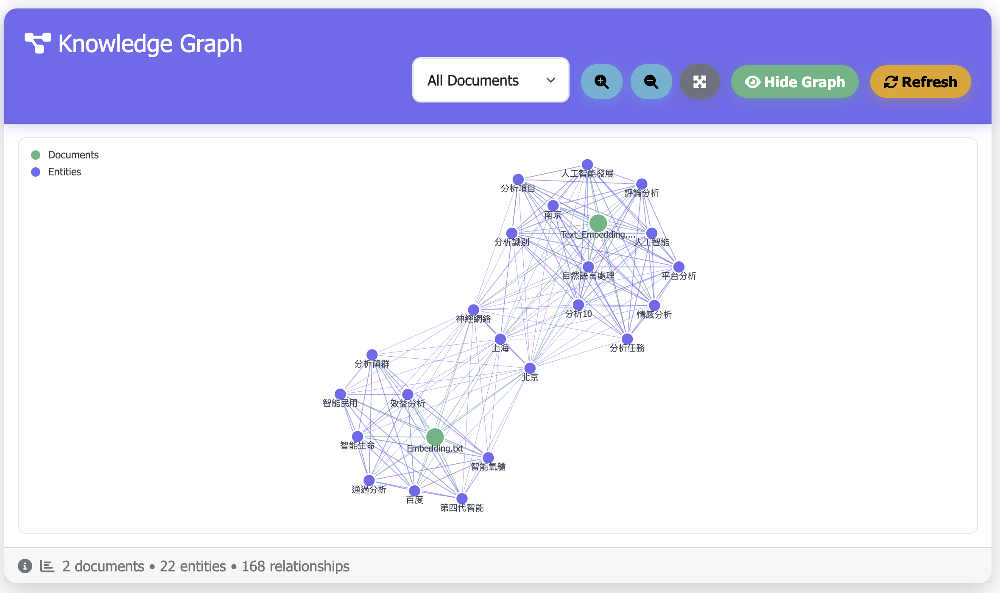
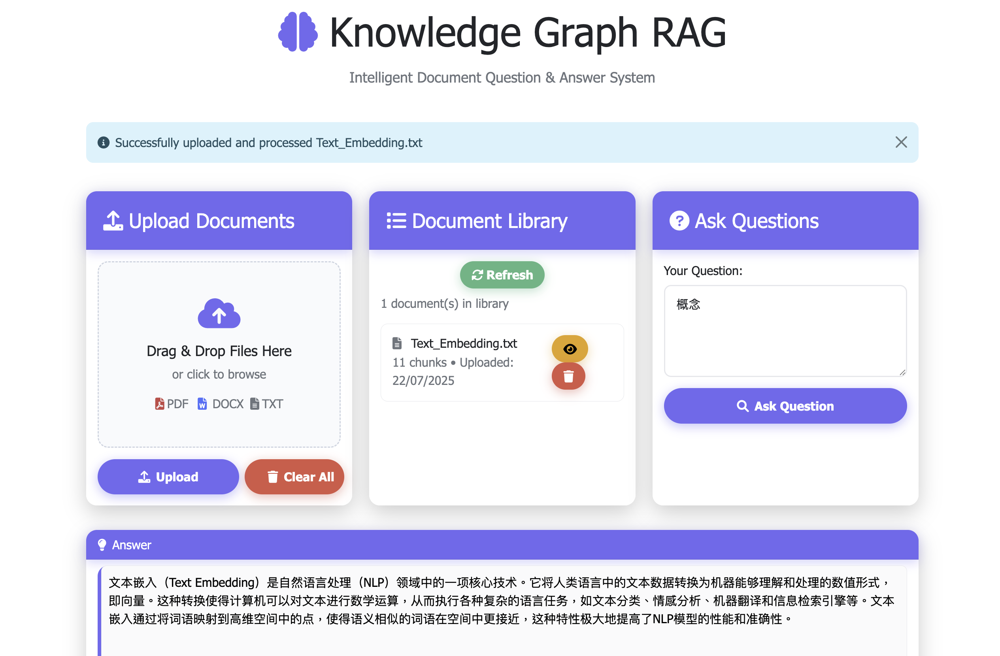

# Knowledge Graph RAG - Web-based Document Q&A System

A modern, responsive web-based Knowledge Graph RAG application that answer questions about your uploaded documents, visualize knowledge graphs, and manage keywords.


## Features

- 🚀 **Modern Responsive Web Interface**: Clean, adaptive UI with drag-and-drop file upload
- 📄 **Multi-format Support**: Upload PDF, DOCX, and TXT files
- 🧠 **AI-Powered Q&A**: Uses Google Gemini for intelligent question answering
- 🔍 **Smart Retrieval**: Vector-based document search using ChromaDB
- ⚡ **Fast Processing**: Efficient text chunking and embedding
- 📚 **Source Attribution**: Shows which documents and chunks were used for answers
- 🕸️ **Knowledge Graph Visualization**: Interactive graph of entities and relationships extracted from your documents
- 🏷️ **Keyword Management**: Manage whitelist/blacklist keywords, reload and view statistics
- 🌐 **Multilingual Support**: Handles Traditional and Simplified Chinese, English, and more
- 🖥️ **Section Layout**: All main sections (Answer, Sources, Knowledge Graph, Features, Keyword Management) have matching widths and improved visual consistency
- 🖱️ **Keyboard Shortcuts**: Press Enter to submit questions, Ctrl+Enter for new lines



## Prerequisites

- Python 3.8 or higher (3.13 not work for Mac)
- Google API key for Gemini (get it from [Google AI Studio](https://makersuite.google.com/app/apikey))
- (Optional) Docker for containerized deployment


## Installation

1. **Clone or download this repository**
   ```bash
   git clone https://github.com/elbartohub/KnowledgeGraphRAG.git
   cd KnowledgeGraphRAG
   ```

2. **Install dependencies:**
   ```bash
   pip install -r requirements.txt
   ```

3. **Set up environment variables:**
   ```bash
   cp .env.example .env
   # Edit .env and add your Google API key and Flask secret
   ```
   Example .env:
   ```
   GOOGLE_API_KEY=your_actual_google_api_key_here
   FLASK_SECRET_KEY=your_secret_key_here
   ```

4. **Run the application:**
   ```bash
   python app.py
   ```

5. **Open your browser and navigate to:**
   ```
   http://localhost:5000
   ```

## Usage

### Quick Start
- Upload documents (PDF, DOCX, TXT)
- Ask questions and view answers with sources
- Explore the knowledge graph and manage keywords

### 1. Upload Documents
- Click on the upload area or drag and drop files
- Supported formats: PDF, DOCX, TXT
- Files are automatically processed and indexed

### 2. Ask Questions
- Type your question in the query box
- Press Enter to submit, Ctrl+Enter for new lines
- The system will show relevant sources used for the answer

### 2. Ask Questions
- Type your question in the query box
- Click "Ask Question" to get AI-powered answers
- The system will show relevant sources used for the answer

### 3. Manage Documents
- Use "Clear All Documents" to remove all uploaded files from the system
- Upload new documents anytime to expand your knowledge base

### 4. Visualize Knowledge Graph
- See entities and relationships extracted from your documents
- Filter by document, zoom, and interact with the graph

### 5. Keyword Management
- Reload keywords, view statistics, and manage whitelist/blacklist

## How It Works

1. **Document Processing**: Files are uploaded and text is extracted
2. **Chunking**: Large documents are split into smaller, manageable chunks
3. **Embedding**: Text chunks are converted to vector embeddings using SentenceTransformers
4. **Storage**: Embeddings are stored in ChromaDB for fast retrieval
5. **Query Processing**: User questions are converted to embeddings and matched against stored chunks
6. **Answer Generation**: Relevant chunks are sent to Gemini AI for intelligent answer generation
7. **Knowledge Graph**: Entities and relationships are visualized interactively
8. **Keyword Management**: Whitelist/blacklist keywords are loaded from files and can be reloaded or viewed

## API Endpoints

See `app.py` for full details. Main endpoints:

- `GET /`: Main application interface
- `POST /upload`: Upload and process documents
- `POST /query`: Ask questions about uploaded documents
- `POST /clear`: Clear all documents from the database
- `GET /health`: Health check endpoint

## Technical Stack

- **Frontend**: Bootstrap 5, Font Awesome, D3.js (for graph)
- **Backend**: Flask (Python web framework)
- **AI Model**: Google Gemini Pro
- **Vector Database**: ChromaDB
- **Embeddings**: SentenceTransformers (locally stored in ./models/)
- **Document Processing**: PyPDF2, python-docx, chardet

## Configuration

See `.env` for environment variables. Keyword files are in `keyword_elements/`.

### Environment Variables

- `GOOGLE_API_KEY`: Your Google API key for Gemini
- `FLASK_SECRET_KEY`: Secret key for Flask sessions
- `FLASK_ENV`: Set to 'production' for deployment

### Customization

You can customize various aspects of the application:

- **Chunk Size**: Modify `chunk_size` parameter in `chunk_text()` function
- **Embedding Model**: Change the SentenceTransformer model
- **Number of Retrieved Chunks**: Adjust `k` parameter in retrieval
- **Gemini Model**: Switch between different Gemini models

## Deployment

For production, use Gunicorn or Docker. See below for examples.

### Local Development
```bash
python app.py
```

### Production with Gunicorn
```bash
gunicorn -w 4 -b 0.0.0.0:5000 app:app
```

### Docker (Optional)
Create a `Dockerfile`:
```dockerfile
FROM python:3.9-slim
WORKDIR /app
COPY requirements.txt .
RUN pip install -r requirements.txt
COPY . .
EXPOSE 5000
CMD ["gunicorn", "-w", "4", "-b", "0.0.0.0:5000", "app:app"]
```

## Troubleshooting

See logs in `app.log` for backend errors. For UI issues, check browser console.

### Common Issues

1. **"GOOGLE_API_KEY not found"**
   - Make sure you've created a `.env` file with your API key
   - Verify the API key is correct and active

2. **Import errors**
   - Ensure all dependencies are installed: `pip install -r requirements.txt`
   - Check Python version compatibility

3. **File upload issues**
   - Verify file format is supported (PDF, DOCX, TXT)
   - Check file size and permissions

4. **No relevant documents found**
   - Make sure documents are uploaded and processed successfully
   - Try more specific or different questions

### Performance Tips

- For large documents, consider increasing chunk size
- For better accuracy, use more specific questions
- Clear old documents periodically to maintain performance

## Security Considerations

Never commit your `.env` file or API keys to version control.

- Keep your Google API key secure and never commit it to version control
- Consider implementing rate limiting for production use
- Validate and sanitize all user inputs
- Use HTTPS in production

## License

MIT License

This project is open source and available under the MIT License.

## Contributing

Pull requests and issues are welcome!

Feel free to submit issues, feature requests, or pull requests to improve this application.

## Support

For help, open an issue or contact the maintainer.

If you encounter any issues or have questions, please check the troubleshooting section or create an issue in the repository.
